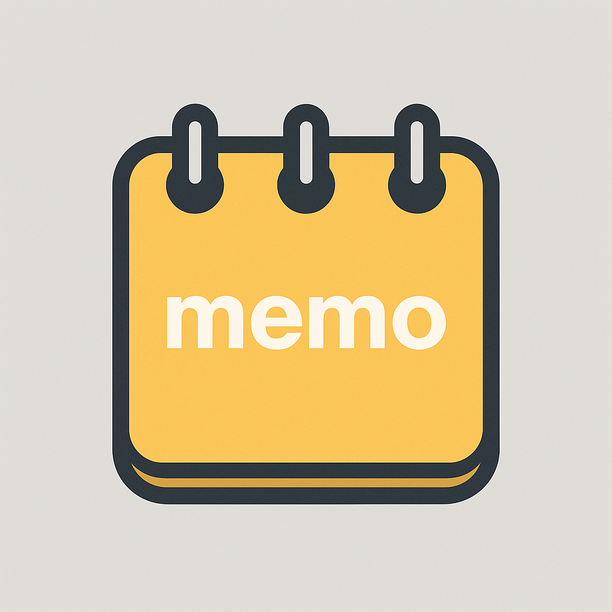
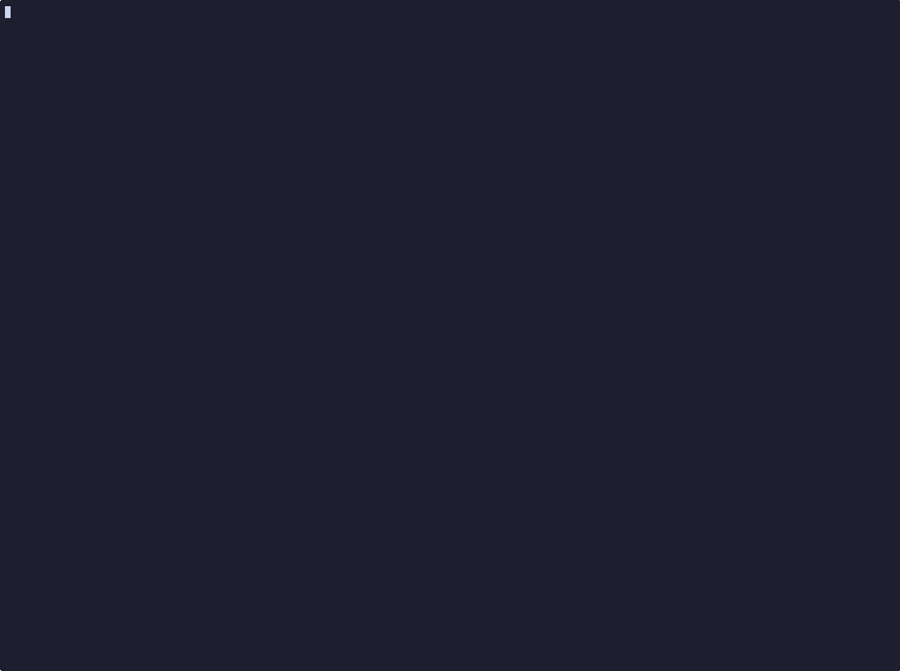

<div align="center" id="top">
  

&#xa0;

  <!-- <a href="https://memo.netlify.app">Demo</a> -->
</div>

<h1 align="center">memo</h1>

<p align="center">
  

  

  

  

  

  

</p>

 <h4 align="center">
 🚧  memo 🚀 Under development...  🚧
</h4>

<hr>

<p align="center">
  <a href="#dart-about">About</a> &#xa0; | &#xa0;
  <a href="#computer-demo">Demo</a> &#xa0; | &#xa0;
  <a href="#sparkles-features">Features</a> &#xa0; | &#xa0;
  <a href="#rocket-technologies">Technologies</a> &#xa0; | &#xa0;
  <a href="#checkered_flag-installation">Installation</a> &#xa0; | &#xa0;
  <a href="#bookmark_tabs-documentation">Documentation</a> &#xa0; | &#xa0;
  <a href="#pushpin-roadmap">Roadmap</a> &#xa0; | &#xa0;
  <a href="#memo-license">License</a>
</p>

<br>

## :dart: About

**Memo** is a simple command-line interface (CLI) tool for managing your Apple Notes and Apple Reminders. It’s written in Python and aims to offer a fast, keyboard-driven way to create, search, and organize notes and reminders straight from your terminal.

**Memo** is used by [OpenClaw](https://github.com/openclaw/openclaw/blob/main/skills/apple-notes/SKILL.md).

## :computer: Demo

<div align="center" id="top">
  

&#xa0;

  <!-- <a href="https://memo.netlify.app">Demo</a> -->
</div>

## :sparkles: Features

:heavy_check_mark: View your notes and reminders directly from the terminal\
:heavy_check_mark: Read the full content of a note as clean Markdown from the terminal\
:heavy_check_mark: Edit your notes and reminders right from the terminal\
:heavy_check_mark: Add new notes and reminders effortlessly through the terminal\
:heavy_check_mark: Move notes to another folder effortlessly through the terminal\
:heavy_check_mark: Mark reminders as completed from the terminal\
:heavy_check_mark: Export your notes to HTML and convert them to Markdown

## :rocket: Technologies

The following tools were used in this project:

- [Click](https://click.palletsprojects.com/en/stable/)
- [Mistune](https://mistune.lepture.com/en/latest/)
- [html2text](https://pypi.org/project/html2text/)

## :checkered_flag: Installation

#### Manual Installation

```bash
git clone https://github.com/antoniorodr/memo

cd memo

pip install .
```

#### Homebrew Installation

```bash
brew tap antoniorodr/memo
brew install antoniorodr/memo/memo
```

## :bookmark_tabs: Documentation

:warning: Be careful when using --edit and --move flags with notes that include images/attachments. Memo does not support this yet. Memo will send you a warning if you try to edit a note with images/attachments.

To read the full documentation, please visit the [docs](https://antoniorodr.github.io/memo)

Use the command `memo notes --help` to see all the options available for notes.

```bash
memo notes --help
Usage: memo notes [OPTIONS]

Options:
  -f, --folder TEXT  Specify a folder to filter the notes (leave empty to get
                     all).
  -a, --add          Add a note to the specified folder. Specify a folder
                     using the --folder flag.
  -e, --edit         Edit a note in the specified folder. Specify a folder
                     using the --folder flag.
  -d, --delete       Delete a note in the specified folder. Specify a folder
                     using the --folder flag.
  -m, --move         Move a note to a different folder.
  -fl, --flist       List all the folders and subfolders.
  -s, --search       Fuzzy search your notes.
  -r, --remove       Remove the folder you specified.
  -ex, --export      Export your notes to the Desktop.
  -v, --view INTEGER Display the content of note N from the list.
  --help             Show this message and exit.
```

Use the command `memo rem --help` to see all the options available for reminders.

```bash
memo rem --help
Usage: memo rem [OPTIONS]

Options:
  -c, --complete  Mark a reminder as completed.
  -a, --add       Add a new reminder.
  -d, --delete    Delete a reminder.
  --help          Show this message and exit.
```

You can use `memo --help` to see the available commands.

```bash
memo --help
Usage: memo [OPTIONS] COMMAND [ARGS]...

Options:
  --version  Show the version and exit.
  --help     Show this message and exit.

Commands:
  notes
  rem
```

Memo uses `$EDITOR` to edit and add notes. You can set it up by running the following command:

```bash
export EDITOR="vim"
```

Where `vim` can be replaced with your preferred editor. Add it to your .zshrc/.bashrc to make it permanent.

Or check the one you have set up in your terminal by running:

```bash
echo $EDITOR
```

## :pushpin: Roadmap

- Check the roadmap [here](https://github.com/users/antoniorodr/projects/2)

## :memo: License

This project is under license from MIT. For more details, see the [LICENSE](LICENSE.md) file.

## :eyes: Do you like my work?

If you like my work and want to support me, you can buy me a coffee ☕ or even a burrito 🌯 by sponsoring me.

[](https://github.com/sponsors/antoniorodr)

&#xa0;

<a href="#top">Back to top</a>
